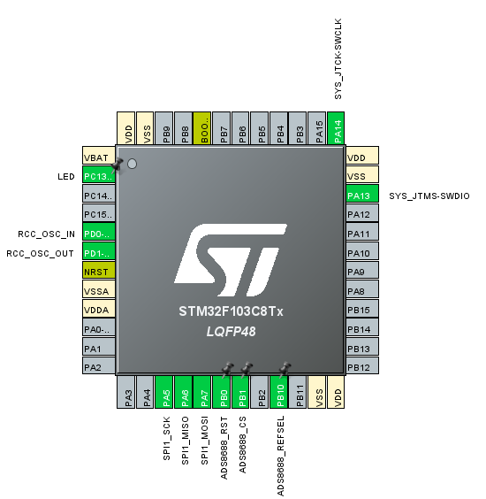

# ADS8688-STM32F103C8

一个基于 STM32F103C8 微控制器的 ADS8688 八通道同步采样模数转换器驱动程序。

> 本代码在 [obatsis/ADS8688-STM32](https://github.com/obatsis/ADS8688-STM32) 的基础上进行修改和扩展，增加了更多功能。  
> 感谢原作者的贡献。

## 📋 项目概述

ADS8688 是一款 16 位、8 通道、同步采样模数转换器，具有 500kSPS 的采样率。本项目提供了完整的 STM32 驱动程序，支持灵活的通道配置、多种电压范围设置和高性能数据采集。

### 🎯 主要特性

- **高精度采样**：16 位分辨率，500kSPS 采样率
- **8 通道同步采样**：支持多通道同步数据采集
- **定时器采样控制**：基于定时器中断的精确采样率控制
- **灵活的通道选择**：支持选择性通道采集，提高采样率
- **多种电压范围**：支持单极性和双极性电压范围
- **SPI 接口**：标准 SPI 通信协议
- **完整的驱动库**：包含初始化、配置、数据采集等完整功能
- **Doxygen 文档**：完整的函数注释和文档

### 🛠️ 硬件要求

| 组件 | 规格 | 说明 |
|------|------|------|
| **主控器** | STM32F103C8T6 蓝板（Blue Pill） | 72MHz ARM Cortex-M3 内核 |
| **ADC 芯片** | ADS8688 | 16位，8通道，500kSPS |
| **通信接口** | SPI | 标准 SPI 协议 |
| **数字电源** | +3.3V | 数字部分供电 |
| **模拟电源** | +5V | 模拟部分供电 |
| **参考电压** | 可配置 | REFSEL 引脚接高电平：由 VREF 引脚输入<br>REFSEL 引脚接低电平：内部 4.095V |

## 📁 项目结构

```
ADS8688-STM32F103C8/
├── Core/
│   ├── Inc/
│   │   ├── ads8688.h              # ADS8688 驱动头文件
│   │   ├── main.h                 # 主程序头文件
│   │   ├── spi.h                  # SPI 配置头文件
│   │   └── gpio.h                 # GPIO 配置头文件
│   └── Src/
│       ├── ads8688.c              # ADS8688 驱动实现
│       ├── main.c                 # 主程序
│       ├── spi.c                  # SPI 配置实现
│       └── gpio.c                 # GPIO 配置实现
├── Drivers/                       # STM32 HAL 驱动
├── Debug/                         # 编译输出目录
├── ADS8688-STM32F103C8.ioc       # STM32CubeMX 配置文件
├── platformio.ini                 # PlatformIO 配置文件
├── ADS8688_SPI_Interface_Guide.md # SPI 接口指南
├── ADS8688_Channel_Selection_Guide.md # 通道选择指南
└── README.md                      # 本文件
```

## 🚀 快速开始

### 1. 硬件连接

#### 引脚连接表

| STM32F103C8 引脚 | ADS8688 引脚 | 功能描述 |
|------------------|--------------|----------|
| PA5 (SPI1_SCK) | SCLK | SPI 时钟信号 |
| PA6 (SPI1_MISO) | SDO | SPI 数据输出 |
| PA7 (SPI1_MOSI) | SDI | SPI 数据输入 |
| ADS8688_CS | CS | 片选信号 |
| ADS8688_RST | RST | 复位信号（低电平时复位） |
| 3.3V | DVDD | ADS8688 数字电源 |
| +5V | AVDD | ADS8688 模拟电源 |
| GND | GND | 电源负极 |

#### 连接示意图



> 💡 **提示**：推荐在图形化界面选择引脚，左键点击 GPIO_OUTPUT，右键放置标签

### 2. 软件配置

#### 移植说明

本项目方便移植到其他 STM32 平台中：

1. **添加驱动文件**：将 `ADS8688.c` 和 `ADS8688.h` 文件添加到新项目中
2. **配置接口**：根据需要修改 `main.c` 文件中的 SPI 和 GPIO 配置
3. **PlatformIO 配置**：如果使用 PlatformIO，请确保在 `platformio.ini` 中配置正确的框架和库

#### SPI 配置示例


### 3. 基本使用示例

#### 基本数据采集

```c
#include "ads8688.h"

// 定义变量
ADS8688_HandleTypeDef ads;
uint16_t ads_data[8];
float voltage[8];

// 初始化
ADS8688_Init(&ads, &hspi1, GPIOA, GPIO_PIN_4);

// 设置通道范围
uint8_t ranges[8] = {
    ADS8688_RANGE_UNIPOLAR_1_25_VREF,  // 通道0: 0-5.12V
    ADS8688_RANGE_UNIPOLAR_1_25_VREF,  // 通道1: 0-5.12V
    ADS8688_RANGE_BIPOLAR_2_5_VREF,    // 通道2: ±10.24V
    // ... 其他通道
};
ADS8688_SetChannelRanges(&ads, ranges);

// 主循环
while(1) {
    // 读取原始数据
    ADS8688_ReadAllChannelsRaw(&ads, ads_data);
    
    // 转换为电压值
    for(int i = 0; i < 8; i++) {
        voltage[i] = ADS8688_ConvertToVoltage(ads_data[i], ranges[i], 4.096f);
    }
    
    // 处理数据...
}
```

#### 定时器采样示例

```c
#include "ads8688.h"

// 定义变量
ADS8688_HandleTypeDef ads;
extern volatile uint8_t sampling_flag;
extern volatile uint32_t sample_count;
uint16_t ads_data[8];
float voltage[8];

int main(void)
{
    // 系统初始化
    HAL_Init();
    SystemClock_Config();
    MX_GPIO_Init();
    MX_SPI1_Init();
    MX_TIM2_Init();  // 定时器初始化
    
    // ADS8688初始化
    ADS8688_Init(&ads, &hspi1, GPIOA, GPIO_PIN_4);
    
    // 设置通道范围
    uint8_t ranges[8] = {ADS8688_RANGE_UNIPOLAR_1_25_VREF, /* ... */};
    ADS8688_SetChannelRanges(&ads, ranges);
    
    // 启动定时器中断采样 (例：10kHz采样率)
    HAL_TIM_Base_Start_IT(&htim2);
    
    // 启用采样
    ADS8688_SetSamplingEnabled(true);
    
    while(1)
    {
        // 等待采样标志
        if(sampling_flag)
        {
            sampling_flag = 0;
            
            // 读取所有通道数据
            if(ADS8688_ReadAllChannelsRaw(&ads, ads_data) == HAL_OK)
            {
                // 转换为电压值
                for(int i = 0; i < 8; i++) {
                    voltage[i] = ADS8688_ConvertToVoltage(ads_data[i], ranges[i], 4.096f);
                }
                
                // 处理数据...
                // 例如：通过串口输出、存储到缓冲区等
            }
        }
        
        // 可选：检查采样计数
        if(sample_count >= 10000) {
            // 达到10000个采样点后的处理
            ADS8688_SetSamplingEnabled(false);  // 停止采样
            // 处理完整的数据集...
        }
    }
}

// 定时器中断回调函数
void HAL_TIM_PeriodElapsedCallback(TIM_HandleTypeDef *htim)
{
    if(htim->Instance == TIM2)
    {
        // 设置采样标志
        sampling_flag = 1;
        sample_count++;
    }
}
```

## 🔧 功能特性

### 电压范围设置

支持以下电压范围：

| 范围宏 | 电压范围 | 说明 |
|--------|----------|------|
| `ADS8688_RANGE_BIPOLAR_2_5_VREF` | ±2.5 × VREF | 双极性 ±10.24V |
| `ADS8688_RANGE_BIPOLAR_1_25_VREF` | ±1.25 × VREF | 双极性 ±5.12V |
| `ADS8688_RANGE_BIPOLAR_0_625_VREF` | ±0.625 × VREF | 双极性 ±2.56V |
| `ADS8688_RANGE_UNIPOLAR_2_5_VREF` | 0 to 2.5 × VREF | 单极性 0-10.24V |
| `ADS8688_RANGE_UNIPOLAR_1_25_VREF` | 0 to 1.25 × VREF | 单极性 0-5.12V |

### 通道选择功能

支持选择性通道采集，提高采样率：

```c
// 只采集通道0和1
ADS8688_SetActiveChannels(&ads, ADS8688_CH0_CH1);

// 读取选定通道数据
uint16_t selected_data[2];
ADS8688_ReadActiveChannelsRaw(&ads, selected_data, ADS8688_CH0_CH1);
```

**采样率提升效果：**
- 单通道：接近 500kSPS
- 双通道：约 250kSPS/通道
- 四通道：约 125kSPS/通道
- 八通道：约 62.5kSPS/通道

### 定时器采样率控制

本项目支持基于定时器中断的固定采样率数据采集，可以精确控制采样时间间隔。

#### 采样率控制原理

采样率控制通过STM32的定时器（TIM2）产生周期性中断来实现。定时器的配置参数决定了采样率的大小。

**定时器频率计算公式：**
```
定时器频率 = 系统时钟频率 / (预分频值 + 1) / (自动重装载值 + 1)
采样率 = 定时器频率
```

对于STM32F103C8（72MHz系统时钟）：
```
采样率 = 72,000,000 / (Prescaler + 1) / (Period + 1)
```

#### 采样率参数表

| 采样率 | 预分频值 (Prescaler) | 自动重装载值 (Period) | 说明 |
|--------|---------------------|---------------------|------|
| 1 kHz | 71 | 999 | 1毫秒采样一次 |
| 2 kHz | 71 | 499 | 500微秒采样一次 |
| 5 kHz | 71 | 199 | 200微秒采样一次 |
| 10 kHz | 71 | 99 | 100微秒采样一次 |
| 20 kHz | 71 | 49 | 50微秒采样一次 |
| 50 kHz | 71 | 19 | 20微秒采样一次 |
| 100 kHz | 71 | 9 | 10微秒采样一次 |
| 200 kHz | 71 | 4 | 5微秒采样一次 |
| 500 kHz | 35 | 3 | 2微秒采样一次 |

#### 采样率配置步骤

1. **在STM32CubeIDE中配置TIM2**：
   - 选择TIM2定时器
   - 设置Clock Source为Internal Clock
   - 设置预分频值和自动重装载值（参考上表）
   - 启用TIM2全局中断

2. **在代码中启用定时器中断**：
   ```c
   // 在main()函数中启动定时器中断
   HAL_TIM_Base_Start_IT(&htim2);
   ```

3. **采样控制函数**：
   ```c
   // 启用/禁用采样
   ADS8688_SetSamplingEnabled(true);   // 开始采样
   ADS8688_SetSamplingEnabled(false);  // 停止采样
   
   // 获取采样计数
   uint32_t count = ADS8688_GetSampleCount();
   
   // 重置采样计数
   ADS8688_ResetSampleCount();
   ```

#### 高级采样率配置

对于更精确的采样率控制，可以使用以下公式计算自定义参数：

```c
// 目标采样率 = 期望的采样频率 (Hz)
// 例如：8192 Hz 采样率
uint32_t target_rate = 8192;
uint32_t prescaler = 71;
uint32_t period = (72000000 / (prescaler + 1) / target_rate) - 1;

// 配置定时器
htim2.Instance = TIM2;
htim2.Init.Prescaler = prescaler;
htim2.Init.Period = period;
htim2.Init.CounterMode = TIM_COUNTERMODE_UP;
htim2.Init.ClockDivision = TIM_CLOCKDIVISION_DIV1;
```

#### 采样率限制与注意事项

1. **硬件限制**：
   - ADS8688最大采样率为500kSPS
   - SPI通信速度限制实际采样率
   - 8通道同时采样时，单通道采样率约为62.5kSPS

2. **软件限制**：
   - 中断处理时间影响最高采样率
   - 数据处理和存储时间
   - 系统其他任务的CPU占用

3. **推荐配置**：
   - 对于8通道采样：建议采样率 ≤ 50kHz
   - 对于4通道采样：建议采样率 ≤ 100kHz
   - 对于单通道采样：建议采样率 ≤ 200kHz

#### 采样率验证

可以通过以下方式验证实际采样率：

```c
// 在定时器中断中切换GPIO，用示波器测量
void HAL_TIM_PeriodElapsedCallback(TIM_HandleTypeDef *htim)
{
    if(htim->Instance == TIM2)
    {
        // 切换测试引脚
        HAL_GPIO_TogglePin(GPIOB, GPIO_PIN_0);
        
        // 触发采样
        sampling_flag = 1;
        sample_count++;
    }
}
```


## 📚 API 参考

### 初始化函数

```c
uint8_t ADS8688_Init(ADS8688_HandleTypeDef *hADS8688, 
                     SPI_HandleTypeDef *hspi, 
                     GPIO_TypeDef *cs_port, 
                     uint16_t cs_pin);
```

### 配置函数

```c
// 设置所有通道范围
HAL_StatusTypeDef ADS8688_SetChannelRanges(ADS8688_HandleTypeDef *hADS8688, 
                                           uint8_t *channel_ranges);

// 设置单个通道范围
HAL_StatusTypeDef ADS8688_SetSingleChannelRange(ADS8688_HandleTypeDef *hADS8688, 
                                                uint8_t channel, 
                                                uint8_t range);

// 设置活动通道
HAL_StatusTypeDef ADS8688_SetActiveChannels(ADS8688_HandleTypeDef *hADS8688, 
                                           uint8_t channel_mask);
```

### 数据采集函数

```c
// 读取所有通道数据
HAL_StatusTypeDef ADS8688_ReadAllChannelsRaw(ADS8688_HandleTypeDef *hADS8688, 
                                            uint16_t *data);

// 读取活动通道数据
HAL_StatusTypeDef ADS8688_ReadActiveChannelsRaw(ADS8688_HandleTypeDef *hADS8688, 
                                               uint16_t *data, 
                                               uint8_t channel_mask);

// 电压转换
float ADS8688_ConvertToVoltage(uint16_t raw_value, 
                               uint8_t range, 
                               float vref);
```

### 采样控制函数

```c
// 启用/禁用采样
void ADS8688_SetSamplingEnabled(bool enabled);

// 获取采样状态
bool ADS8688_GetSamplingEnabled(void);

// 获取采样计数
uint32_t ADS8688_GetSampleCount(void);

// 重置采样计数
void ADS8688_ResetSampleCount(void);

// 获取历史数据
uint16_t ADS8688_GetHistoryData(uint8_t channel, uint16_t index);

// 获取历史数据索引
uint16_t ADS8688_GetHistoryIndex(void);
```

// 读取活动通道数据
HAL_StatusTypeDef ADS8688_ReadActiveChannelsRaw(ADS8688_HandleTypeDef *hADS8688, 
                                               uint16_t *data, 
                                               uint8_t channel_mask);

// 电压转换
float ADS8688_ConvertToVoltage(uint16_t raw_value, 
                               uint8_t range, 
                               float vref);
```

### 底层函数

```c
// 读写寄存器
HAL_StatusTypeDef ADS8688_ReadRegister(ADS8688_HandleTypeDef *hADS8688, 
                                      uint8_t reg, 
                                      uint8_t *data);

HAL_StatusTypeDef ADS8688_WriteRegister(ADS8688_HandleTypeDef *hADS8688, 
                                       uint8_t reg, 
                                       uint8_t *data);

// 发送命令
HAL_StatusTypeDef ADS8688_SendCommand(ADS8688_HandleTypeDef *hADS8688, 
                                     uint8_t cmd, 
                                     uint8_t *data);
```


## 📊 性能优化

### 提高采样率的方法

1. **选择性通道采集**：只采集需要的通道
2. **提高 SPI 速度**：使用更高的 SPI 时钟频率
3. **使用 DMA**：减少 CPU 负载
4. **优化数据处理**：减少循环中的计算量
5. **合理配置定时器**：选择合适的采样率参数

### 采样率性能分析

| 采样配置 | 理论采样率 | 实际采样率 | CPU占用率 | 推荐场景 |
|----------|------------|------------|-----------|----------|
| 单通道 | 500kSPS | ~200kSPS | 60% | 高速单通道采集 |
| 双通道 | 250kSPS/通道 | ~100kSPS/通道 | 70% | 双通道同步采集 |
| 四通道 | 125kSPS/通道 | ~50kSPS/通道 | 80% | 多通道中速采集 |
| 八通道 | 62.5kSPS/通道 | ~25kSPS/通道 | 90% | 全通道低速采集 |

### DMA配置优化

使用DMA可以显著提高采样性能并降低CPU负载：

```c
// 在STM32CubeIDE中启用SPI DMA
// 1. 在SPI1配置中启用DMA
// 2. 配置DMA1 Channel 2 (SPI1_RX)
// 3. 配置DMA1 Channel 3 (SPI1_TX)

// DMA采样示例
HAL_StatusTypeDef ADS8688_ReadAllChannelsRaw_DMA(ADS8688_HandleTypeDef *hADS8688, uint16_t *data)
{
    // 使用DMA进行数据传输
    return HAL_SPI_TransmitReceive_DMA(hADS8688->hspi, tx_buffer, (uint8_t*)data, 16);
}
```

### 内存优化

```c
// 根据实际需要的通道数量分配内存
#define MAX_ACTIVE_CHANNELS 4
uint16_t buffer[MAX_ACTIVE_CHANNELS];
```

## 🐛 故障排除

### 常见问题及解决方案

1. **SPI 通信失败**
   - 检查硬件连接
   - 确认 SPI 配置正确
   - 检查片选信号时序

2. **电压转换不准确**
   - 确认参考电压值正确（ADS8688_VREF引脚接高电平参考电压为外部输入，接低电平为内部参考电压4.095V）
   - 检查通道范围设置

3. **采样率问题**
   - **采样率过低**：
     - 检查定时器配置参数
     - 确认定时器中断已启用
     - 检查中断优先级设置
   - **采样率不稳定**：
     - 检查系统时钟配置
     - 确认没有其他高优先级中断干扰
     - 检查采样处理时间是否过长
   - **采样丢失**：
     - 检查采样标志处理逻辑
     - 确认缓冲区大小足够
     - 检查是否有数据溢出

4. **数据采集异常**
   - **数据全为0或65535**：
     - 检查SPI数据位宽设置（8位/16位）
     - 确认通道映射正确
     - 检查电源和参考电压
   - **通道数据错位**：
     - 检查通道选择逻辑
     - 确认SPI数据解析正确
     - 验证数据包格式

### 采样率调试步骤

1. **验证定时器配置**：
   ```c
   // 添加调试输出
   printf("Timer Prescaler: %d\n", htim2.Init.Prescaler);
   printf("Timer Period: %d\n", htim2.Init.Period);
   printf("Expected Rate: %.2f Hz\n", 72000000.0 / (htim2.Init.Prescaler + 1) / (htim2.Init.Period + 1));
   ```

2. **监控实际采样率**：
   ```c
   // 在1秒内计算采样次数
   uint32_t last_count = 0;
   uint32_t current_time = HAL_GetTick();
   static uint32_t last_time = 0;
   
   if(current_time - last_time >= 1000) // 每秒统计一次
   {
       uint32_t samples_per_second = sample_count - last_count;
       printf("Actual sampling rate: %d Hz\n", samples_per_second);
       last_count = sample_count;
       last_time = current_time;
   }
   ```

3. **检查中断执行时间**：
   ```c
   void HAL_TIM_PeriodElapsedCallback(TIM_HandleTypeDef *htim)
   {
       if(htim->Instance == TIM2)
       {
           // 设置调试引脚高电平
           HAL_GPIO_WritePin(GPIOB, GPIO_PIN_0, GPIO_PIN_SET);
           
           sampling_flag = 1;
           sample_count++;
           
           // 设置调试引脚低电平
           HAL_GPIO_WritePin(GPIOB, GPIO_PIN_0, GPIO_PIN_RESET);
       }
   }
   ```

### 调试建议

1. 使用示波器检查 SPI 信号和定时器触发信号
2. 通过串口输出调试信息和采样率统计
3. 逐步测试各个功能模块
4. 使用逻辑分析仪分析数字信号时序
5. 监控系统资源使用情况（CPU、内存）

## 📖 文档

- [SPI 接口指南](ADS8688_SPI_Interface_Guide.md)
- [通道选择指南](ADS8688_Channel_Selection_Guide.md)
- [ADS8688 数据手册](https://www.ti.com/product/ADS8688)

## 🤝 贡献

欢迎提交 Issue 和 Pull Request 来改进本项目。

## 📄 许可证

本项目采用 MIT 许可证，详见 [LICENSE](LICENSE) 文件。

## 📞 联系

如有问题或建议，请提交 Issue 或联系项目维护者。

---

**注意**：本项目基于 STM32 HAL 库开发，请确保您的开发环境已正确配置。
