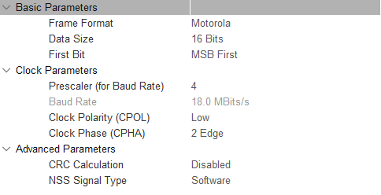

# ADS8688-STM32F103C8 基础驱动

基于 STM32F103C8 微控制器的 ADS8688 基础驱动程序，适合学习和简单应用场景。

> 本示例为ADS8688驱动的**基础版本**，提供完整的功能接口和详细的使用说明。如需高性能应用，请参考 [STM32H743VI版本](../ADS8688-STM32H743VI/README.md)。


### 🛠️ 硬件要求

| 组件 | 规格 | 说明 |
|------|------|------|
| **主控器** | STM32F103C8T6 蓝板（Blue Pill） | 72MHz ARM Cortex-M3 内核 |

> 其他硬件要求请参考 [项目根目录说明](../README.md#🛠️-硬件要求)

## 📁 项目结构

```
ADS8688-STM32F103C8/
├── Core/
│   ├── Inc/
│   │   ├── ads8688.h              # ADS8688 驱动头文件
│   │   ├── main.h                 # 主程序头文件
│   │   ├── spi.h                  # SPI 配置头文件
│   │   └── gpio.h                 # GPIO 配置头文件
│   └── Src/
│       ├── ads8688.c              # ADS8688 驱动实现
│       ├── main.c                 # 主程序
│       ├── spi.c                  # SPI 配置实现
│       └── gpio.c                 # GPIO 配置实现
├── Drivers/                       # STM32 HAL 驱动
├── Debug/                         # 编译输出目录
├── ADS8688-STM32F103C8.ioc       # STM32CubeMX 配置文件
├── platformio.ini                 # PlatformIO 配置文件
├── ADS8688_SPI_Interface_Guide.md # SPI 接口指南
├── ADS8688_Channel_Selection_Guide.md # 通道选择指南
└── README.md                      # 本文件
```

## 🚀 快速开始

### 1. 硬件连接

详细的硬件连接信息请参考 [项目根目录说明](../README.md#🛠️-硬件要求)。

#### 引脚连接表

| STM32F103C8 引脚 | ADS8688 引脚 | 功能描述 |
|------------------|--------------|----------|
| PA5 (SPI1_SCK) | SCLK | SPI 时钟信号 |
| PA6 (SPI1_MISO) | SDO | SPI 数据输出 |
| PA7 (SPI1_MOSI) | SDI | SPI 数据输入 |
| ADS8688_CS | CS | 片选信号 |
| ADS8688_RST | RST | 复位信号（低电平时复位） |

### 2. 软件配置

#### 移植说明

本项目方便移植到其他 STM32 平台中：

1. **添加驱动文件**：将 `ADS8688.c` 和 `ADS8688.h` 文件添加到新项目中
2. **配置接口**：根据需要修改 `main.c` 文件中的 SPI 和 GPIO 配置
3. **PlatformIO 配置**：如果使用 PlatformIO，请确保在 `platformio.ini` 中配置正确的框架和库

#### SPI 配置示例




### 3. 基本使用示例

#### 简单轮询采样

```c
#include "ads8688.h"

// 定义变量
ADS8688_HandleTypeDef ads;
uint16_t ads_data[8];
float voltage[8];

int main(void)
{
    // 系统初始化
    HAL_Init();
    SystemClock_Config();
    MX_GPIO_Init();
    MX_SPI1_Init();
    
    // ADS8688初始化
    ADS8688_Init(&ads, &hspi1, GPIOA, GPIO_PIN_4);
    
    // 设置通道范围
    uint8_t ranges[8] = {
        ADS8688_RANGE_UNIPOLAR_1_25_VREF,  // 通道0: 0-5.12V
        ADS8688_RANGE_UNIPOLAR_1_25_VREF,  // 通道1: 0-5.12V
        ADS8688_RANGE_BIPOLAR_2_5_VREF,    // 通道2: ±10.24V
        // ... 其他通道
    };
    ADS8688_SetChannelRanges(&ads, ranges);
    
    // 主循环
    while(1) {
        // 读取原始数据
        ADS8688_ReadAllChannelsRaw(&ads, ads_data);
        
        // 转换为电压值
        for(int i = 0; i < 8; i++) {
            voltage[i] = ADS8688_ConvertToVoltage(ads_data[i], ranges[i], 4.096f);
        }
        
        // 处理数据...
        HAL_Delay(100);  // 简单延时
    }
}
```

> **注意**：STM32F103C8由于性能限制，不建议使用定时器中断采样。请使用 [STM32H743VI版本](../ADS8688-STM32H743VI/README.md)。

### 通道选择功能

针对F103的资源优化：

```c
// 只采集必要的通道以提高采样率,并且要修改ADS8688_NUM_CHANNELS
ADS8688_SetActiveChannels(&ads, 0b00000011);  // 只采集通道0和1

// 或者使用读取选定通道数据
uint16_t selected_data[2];
ADS8688_ReadActiveChannelsRaw(&ads, selected_data, ADS8688_CH0_CH1);
```


## 📚 API 参考

基础API接口说明，详细内容请参考 [项目根目录API文档](../README.md#📚-api-参考)。

### F103专用函数示例

```c
// 简单初始化
HAL_StatusTypeDef init_result = ADS8688_Init(&ads, &hspi1, GPIOA, GPIO_PIN_4);

// 基础数据读取
HAL_StatusTypeDef read_result = ADS8688_ReadAllChannelsRaw(&ads, ads_data);

// 电压转换
float voltage = ADS8688_ConvertToVoltage(ads_data[0], ADS8688_RANGE_UNIPOLAR_1_25_VREF, 4.096f);
```

## 🐛 故障排除

### 常见问题及解决方案

1. **检查复位引脚是否为高电平**：
    - 确保ADS8688的复位引脚（RST）在初始化时为高电平。
2. **SPI通信异常**：
    - 确认SPI引脚连接正确，尤其是SCLK、MISO、MOSI和CS引脚。
    - 检查SPI配置是否与ADS8688的要求匹配（如时钟极性和相位）。

### 调试建议

1. 使用示波器检查 SPI 信号和定时器触发信号
2. 通过串口输出调试信息和采样率统计
3. 逐步测试各个功能模块
4. 使用逻辑分析仪分析数字信号时序
5. 监控系统资源使用情况（CPU、内存）

## 📖 文档

- [SPI 接口指南](ADS8688_SPI_Interface_Guide.md)
- [通道选择指南](ADS8688_Channel_Selection_Guide.md)
- [ADS8688 数据手册](https://www.ti.com/product/ADS8688)

## 🤝 贡献

欢迎提交 Issue 和 Pull Request 来改进本项目。

## 📄 许可证

本项目采用 MIT 许可证，详见 [LICENSE](LICENSE) 文件。

## 📞 联系

如有问题或建议，请提交 Issue 或联系项目维护者。

---

**注意**：本项目基于 STM32 HAL 库开发，请确保您的开发环境已正确配置。
