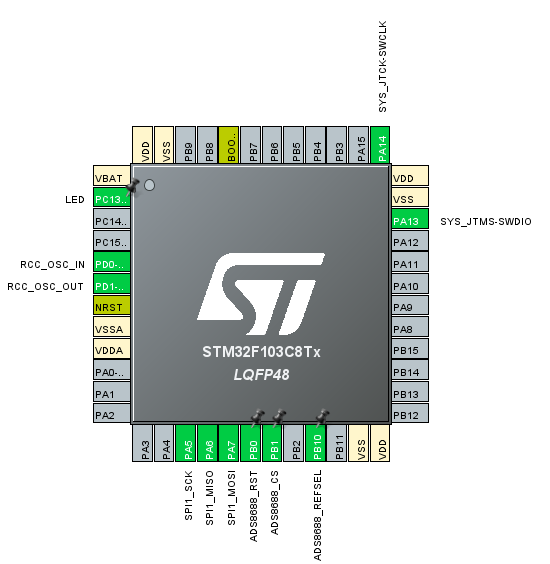
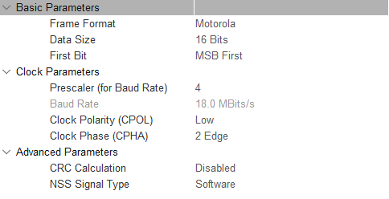

# ADS8688-STM32F103C8

一个基于 STM32F103C8 微控制器的 ADS8688 八通道同步采样模数转换器驱动程序。

> 本代码在 [obatsis/ADS8688-STM32](https://github.com/obatsis/ADS8688-STM32) 的基础上进行修改和扩展，增加了更多功能。  
> 感谢原作者的贡献。

## 📋 项目概述

ADS8688 是一款 16 位、8 通道、同步采样模数转换器，具有 500kSPS 的采样率。本项目提供了完整的 STM32 驱动程序，支持灵活的通道配置、多种电压范围设置和高性能数据采集。

### 🎯 主要特性

- **高精度采样**：16 位分辨率，500kSPS 采样率
- **8 通道同步采样**：支持多通道同步数据采集
- **灵活的通道选择**：支持选择性通道采集，提高采样率
- **多种电压范围**：支持单极性和双极性电压范围
- **SPI 接口**：标准 SPI 通信协议
- **完整的驱动库**：包含初始化、配置、数据采集等完整功能
- **Doxygen 文档**：完整的函数注释和文档

### 🛠️ 硬件要求

| 组件 | 规格 | 说明 |
|------|------|------|
| **主控器** | STM32F103C8T6 蓝板（Blue Pill） | 72MHz ARM Cortex-M3 内核 |
| **ADC 芯片** | ADS8688 | 16位，8通道，500kSPS |
| **通信接口** | SPI | 标准 SPI 协议 |
| **数字电源** | +3.3V | 数字部分供电 |
| **模拟电源** | +5V | 模拟部分供电 |
| **参考电压** | 可配置 | REFSEL 引脚接高电平：由 VREF 引脚输入<br>REFSEL 引脚接低电平：内部 4.095V |

## 📁 项目结构

```
ADS8688-STM32F103C8/
├── Core/
│   ├── Inc/
│   │   ├── ads8688.h              # ADS8688 驱动头文件
│   │   ├── main.h                 # 主程序头文件
│   │   ├── spi.h                  # SPI 配置头文件
│   │   └── gpio.h                 # GPIO 配置头文件
│   └── Src/
│       ├── ads8688.c              # ADS8688 驱动实现
│       ├── main.c                 # 主程序
│       ├── spi.c                  # SPI 配置实现
│       └── gpio.c                 # GPIO 配置实现
├── Drivers/                       # STM32 HAL 驱动
├── Debug/                         # 编译输出目录
├── ADS8688-STM32F103C8.ioc       # STM32CubeMX 配置文件
├── platformio.ini                 # PlatformIO 配置文件
├── ADS8688_SPI_Interface_Guide.md # SPI 接口指南
├── ADS8688_Channel_Selection_Guide.md # 通道选择指南
└── README.md                      # 本文件
```

## 🚀 快速开始

### 1. 硬件连接

#### 引脚连接表

| STM32F103C8 引脚 | ADS8688 引脚 | 功能描述 |
|------------------|--------------|----------|
| PA5 (SPI1_SCK) | SCLK | SPI 时钟信号 |
| PA6 (SPI1_MISO) | SDO | SPI 数据输出 |
| PA7 (SPI1_MOSI) | SDI | SPI 数据输入 |
| ADS8688_CS | CS | 片选信号 |
| ADS8688_RST | RST | 复位信号（低电平时复位） |
| 3.3V | DVDD | ADS8688 数字电源 |
| +5V | AVDD | ADS8688 模拟电源 |
| GND | GND | 电源负极 |

#### 连接示意图



> 💡 **提示**：推荐在图形化界面选择引脚，左键点击 GPIO_OUTPUT，右键放置标签

### 2. 软件配置

#### 移植说明

本项目方便移植到其他 STM32 平台中：

1. **添加驱动文件**：将 `ADS8688.c` 和 `ADS8688.h` 文件添加到新项目中
2. **配置接口**：根据需要修改 `main.c` 文件中的 SPI 和 GPIO 配置
3. **PlatformIO 配置**：如果使用 PlatformIO，请确保在 `platformio.ini` 中配置正确的框架和库

#### SPI 配置示例




### 3. 基本使用示例

```c
#include "ads8688.h"

// 定义变量
ADS8688_HandleTypeDef ads;
uint16_t ads_data[8];
float voltage[8];

// 初始化
ADS8688_Init(&ads, &hspi1, GPIOA, GPIO_PIN_4);

// 设置通道范围
uint8_t ranges[8] = {
    ADS8688_RANGE_UNIPOLAR_1_25_VREF,  // 通道0: 0-5.12V
    ADS8688_RANGE_UNIPOLAR_1_25_VREF,  // 通道1: 0-5.12V
    ADS8688_RANGE_BIPOLAR_2_5_VREF,    // 通道2: ±10.24V
    // ... 其他通道
};
ADS8688_SetChannelRanges(&ads, ranges);

// 主循环
while(1) {
    // 读取原始数据
    ADS8688_ReadAllChannelsRaw(&ads, ads_data);
    
    // 转换为电压值
    for(int i = 0; i < 8; i++) {
        voltage[i] = ADS8688_ConvertToVoltage(ads_data[i], ranges[i], 4.096f);
    }
    
    // 处理数据...
}
```

## 🔧 功能特性

### 电压范围设置

支持以下电压范围：

| 范围宏 | 电压范围 | 说明 |
|--------|----------|------|
| `ADS8688_RANGE_BIPOLAR_2_5_VREF` | ±2.5 × VREF | 双极性 ±10.24V |
| `ADS8688_RANGE_BIPOLAR_1_25_VREF` | ±1.25 × VREF | 双极性 ±5.12V |
| `ADS8688_RANGE_BIPOLAR_0_625_VREF` | ±0.625 × VREF | 双极性 ±2.56V |
| `ADS8688_RANGE_UNIPOLAR_2_5_VREF` | 0 to 2.5 × VREF | 单极性 0-10.24V |
| `ADS8688_RANGE_UNIPOLAR_1_25_VREF` | 0 to 1.25 × VREF | 单极性 0-5.12V |

### 通道选择功能

支持选择性通道采集，提高采样率：

```c
// 只采集通道0和1
ADS8688_SetActiveChannels(&ads, ADS8688_CH0_CH1);

// 读取选定通道数据
uint16_t selected_data[2];
ADS8688_ReadActiveChannelsRaw(&ads, selected_data, ADS8688_CH0_CH1);
```

**采样率提升效果：**
- 单通道：接近 500kSPS
- 双通道：约 250kSPS/通道
- 四通道：约 125kSPS/通道
- 八通道：约 62.5kSPS/通道


## 📚 API 参考

### 初始化函数

```c
uint8_t ADS8688_Init(ADS8688_HandleTypeDef *hADS8688, 
                     SPI_HandleTypeDef *hspi, 
                     GPIO_TypeDef *cs_port, 
                     uint16_t cs_pin);
```

### 配置函数

```c
// 设置所有通道范围
HAL_StatusTypeDef ADS8688_SetChannelRanges(ADS8688_HandleTypeDef *hADS8688, 
                                           uint8_t *channel_ranges);

// 设置单个通道范围
HAL_StatusTypeDef ADS8688_SetSingleChannelRange(ADS8688_HandleTypeDef *hADS8688, 
                                                uint8_t channel, 
                                                uint8_t range);

// 设置活动通道
HAL_StatusTypeDef ADS8688_SetActiveChannels(ADS8688_HandleTypeDef *hADS8688, 
                                           uint8_t channel_mask);
```

### 数据采集函数

```c
// 读取所有通道数据
HAL_StatusTypeDef ADS8688_ReadAllChannelsRaw(ADS8688_HandleTypeDef *hADS8688, 
                                            uint16_t *data);

// 读取活动通道数据
HAL_StatusTypeDef ADS8688_ReadActiveChannelsRaw(ADS8688_HandleTypeDef *hADS8688, 
                                               uint16_t *data, 
                                               uint8_t channel_mask);

// 电压转换
float ADS8688_ConvertToVoltage(uint16_t raw_value, 
                               uint8_t range, 
                               float vref);
```

### 底层函数

```c
// 读写寄存器
HAL_StatusTypeDef ADS8688_ReadRegister(ADS8688_HandleTypeDef *hADS8688, 
                                      uint8_t reg, 
                                      uint8_t *data);

HAL_StatusTypeDef ADS8688_WriteRegister(ADS8688_HandleTypeDef *hADS8688, 
                                       uint8_t reg, 
                                       uint8_t *data);

// 发送命令
HAL_StatusTypeDef ADS8688_SendCommand(ADS8688_HandleTypeDef *hADS8688, 
                                     uint8_t cmd, 
                                     uint8_t *data);
```


## 📊 性能优化

### 提高采样率的方法

1. **选择性通道采集**：只采集需要的通道
2. **提高 SPI 速度**：使用更高的 SPI 时钟频率
3. **使用 DMA**：减少 CPU 负载
4. **优化数据处理**：减少循环中的计算量

### 内存优化

```c
// 根据实际需要的通道数量分配内存
#define MAX_ACTIVE_CHANNELS 4
uint16_t buffer[MAX_ACTIVE_CHANNELS];
```

## 🐛 故障排除


1. **SPI 通信失败**
   - 检查硬件连接
   - 确认 SPI 配置正确
   - 检查片选信号时序

2. **电压转换不准确**
   - 确认参考电压值正确（ADS8688_VREF引脚接高电平参考电压为外部输入，接低电平为内部参考电压4.095V）
   - 检查通道范围设置

### 调试建议

1. 使用示波器检查 SPI 信号
2. 通过串口输出调试信息
3. 逐步测试各个功能模块

## 📖 文档

- [SPI 接口指南](ADS8688_SPI_Interface_Guide.md)
- [通道选择指南](ADS8688_Channel_Selection_Guide.md)
- [ADS8688 数据手册](https://www.ti.com/product/ADS8688)

## 🤝 贡献

欢迎提交 Issue 和 Pull Request 来改进本项目。

## 📄 许可证

本项目采用 MIT 许可证，详见 [LICENSE](LICENSE) 文件。

## 📞 联系

如有问题或建议，请提交 Issue 或联系项目维护者。

---

**注意**：本项目基于 STM32 HAL 库开发，请确保您的开发环境已正确配置。
